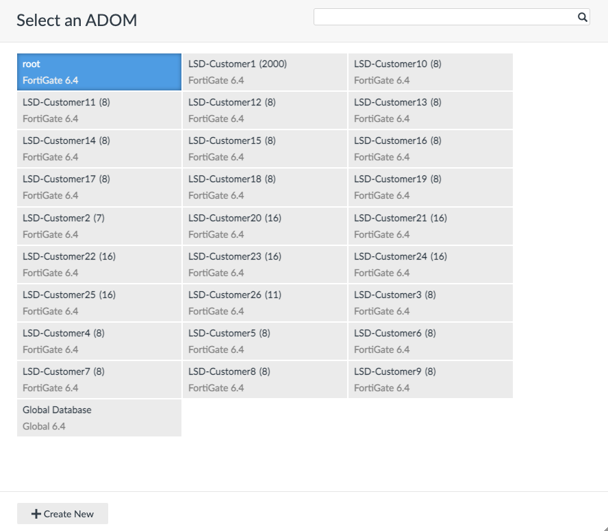
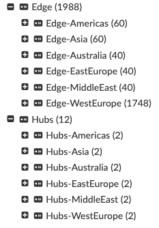

# Large Scale Deployment: SD-WAN Design and Provisioning

<!-- TOC -->

- [Tenants and Topology](#tenants-and-topology)
- [SD-WAN Solution Configuration](#sd-wan-solution-configuration)
- [Provisioning Automation](#provisioning-automation)
  - [Input Files](#input-files)
  - [Scripts](#scripts)
  - [Reference: Input Files](#reference-input-files)

<!-- /TOC -->

## Tenants and Topology

We have 26 end-customers ("tenants") for whom we define 26 ADOMs on FMG/FAZ.
The naming is `LSD-Customer$i` where i is 1..26:



- **LSD-Customer1** is a large tenant with 2000 sites in 6 regions, using all Ns on massive2/massive3 (2\*750) + N=5,9 on massive=1 (2\*250).

  Further details:

  | Region     | #Sites (Hubs / Edges) | List of Sites                                                                |
  |:-----------|:----------------------|:-----------------------------------------------------------------------------|
  | WestEurope | 1750 (2 / 1748)       | Hubs = [2-1, 3-1]; Edges = { all Ns on massive2/massive3 + N=9 on massive1 } |
  | EastEurope | 42 (2 / 40)           | Hubs = [5-1, 5-2]; Edges = { N=5, M=11..50 }                                 |
  | Americas   | 62 (2 / 60)           | Hubs = [5-3, 5-4]; Edges = { N=5, M=51..110 }                                |
  | Asia       | 62 (2 / 60)           | Hubs = [5-5, 5-6]; Edges = { N=5, M=111..170}                                |
  | MiddleEast | 42 (2 / 40)           | Hubs = [5-7, 5-8]; Edges = { N=5, M=171..210}                                |
  | Australia  | 42 (2 / 40)           | Hubs = [5-9, 5-10]; Edges = { N=5, M=211..250}                               |

  

- The other 25 tenants (**LSD-Customer2, ..., LSD-Customer26**) use the remaining N=1 on massive1, 250 sites in total.
  They all have single region with either one or two Hubs, usually with either 8 or 16 sites
  (with an exception of the "corner" tenants which simply have what the numbers let them have).

  The membership simply goes in running order of M: LSD-Customer2 starts with 1-1, 1-2 etc. Then LSD-Customer3 continues, and so on.
  For each tenant, the first one or two sites are the Hubs, the rest are the Edges.

  Further details:

  | Tenant             | #Sites (Hubs / Edges) |
  |:-------------------|:----------------------|
  | LSD-Customer2      | 7 (1 / 6)             |
  | LSD-Customer3..19  | 8 (1 / 7)             |
  | LSD-Customer20..25 | 16 (2 / 14)           |
  | LSD-Customer26     | 11 (2 / 9)            |

  For even more details, see the exact tenant definition files under `tenants/LSD-Customer$i/tenant.yaml.j2`.

## SD-WAN Solution Configuration

The following components are used on FMG to configure this solution:

- VPN Manager - to configure overlays
- CLI Tempaltes - to adjust overlay configuration and configure routing (BGP + static routes)
- System Template - to configure logging to FAZ
- SD-WAN Tempates - to configure SD-WAN

Additionally, CLI Scripts had to be used to configure inter-regional routing on the Hubs belonging to LSD-Customer1,
because this part of the configuration is not easy to template.

## Provisioning Automation

This folder contains automation scripts (python and bash) used to automate the deployment described above.

### Input Files

The inputs are under `tenants` folder, and there is a subfolder per-tenant.
There you will find the following:

- `tenant.yaml.j2` is the main YAML describing the tenant deployment.
  It describes all the regions that the tenant has, for each region it lists Hubs and Edges.
  It also defines some additional arguments (the full reference will follow).
  This file is a Jinja2 template, so that the YAML itself will be rendered on the fly.
  This allows to use loops etc. to simplify tenant definition. For example:

  ```
  edge:
    
    - site-5-{{ M }}
    
  ```

  The above snippet is supposed to define a list called `edge` that contains 40 elements (site-5-211, site-5-212, ..., site-5-250).  
  Instead of listing them all, a short readable Jinja2 loop is used.

- `cli_templates` is a subfolder with FMG CLI Templates that will be pushed to the FMG.
  They are not processed in any way, just pushed to FMG "as is".

- `cli_scripts` is a similar subfolder (only needed for LSD-Customer1) that contains CLI Scripts to be pushed to FMG.

- Geo-files can be also found in the tenant input folder (currently only for LSD-Customer1).
  They define geographical coordinates that will be set for devices, to spread them nicely on the map.
  Those are generated externally (using some online generator of random coordinates).
  These geo-files are then referred in `tenant.yaml.j2` per region - see `geo-file` attribute.

In addition to the per-tenant inputs, there is also a global configuration file - `config.yaml`.
It mainly defines the IPs and credentials of FMG/FAZ.

For the full reference of currently supported arguments in `tenant.yaml.j2` and `config.yaml`, refer to a separate section below.

### Scripts

The deployment is done using FMG APIs. The calls are all done by python scripts `lsd_*.py`.
They use Classes defined under `fmg_api` folder that wrap API calls.

Additionally, there is `lsd_base.py` that does some common functionality, such as config parsing etc.,
so whoever needs to add another `lsd_*.py` should probably start from this skeleton:

```
#!/usr/bin/env python3

from fmg_api.device_manager import DeviceManagerApi
from lsd_base import *

def main():

    cfg = readConfig()

    dev_session = DeviceManagerApi(
        url = cfg['fmg_api'],
        adom = cfg['adom'],
        user = cfg['fmg_user'],
        password = cfg['fmg_password']
    )

if __name__ == "__main__":
    main()    
```

Here we create `DeviceManagerApi` instance, but it depends on what exactly you want to do.
The main concept remains the same: you call `readConfig()` from `lsd_base`, then
you get a `cfg` dict with combined inputs (`tenant.yaml.j2` + `config.yaml` merged together),
then you use it to create an instance of the Class that you are looking for.

All the scripts read environment variable `LSD_TENANT` in order to get tenant's name.
Then they find the right input files under `tenants/$LSD_TENANT` to proceed.
Hence, one way to run the automation scripts would be:

```
LSD_TENANT=LSD-Customer20 ./lsd_<whatever>.py
```

Sometimes the scripts ask for user confirmation (y / n).
If this is undesired, you can add environment variable `QUIET=1`, in which case the answer "y" will be assumed.

Finally, there is bash script `add_oneregion_tenant.sh` that completely automates the deployment of a single-region tenant (such as LSD-Customer2, ..., LSD-Customer26).
This script simply gathers all the needed `lsd_*.py` in the right order:

```
#!/bin/bash

if [ $# -ne 1 ]; then echo ERROR: Must provide tenant name in args; exit; fi

export LSD_TENANT=$1
export QUIET=1
set -o xtrace

./lsd_adom_add.py
./lsd_dev_add.py
./lsd_vpn_add.py
./lsd_sdwan_add.py
./lsd_install_policy.py
```

Hence, summarizing all the above, you can deploy a tenant such as LSD-Customer25 completely from scratch (starting from empty ADOM creation), like this:

```
./add_oneregion_tenant.sh LSD-Customer25
```

### Reference: Input Files

Global config file (`config.yaml`) currently supports the following items:

| Item             | Type            | Description                                                                                              |
|:-----------------|:----------------|:---------------------------------------------------------------------------------------------------------|
| `fmg_api`        | string          | HTTPS URL to the FMG API endpoint (including `/jsonrpc` ending)                                          |
| `faz_api`        | string          | HTTPS URL to the FAZ API endpoint (including `/jsonrpc` ending)                                          |
| `faz_ip`         | string          | FAZ IP to be used by FGTs to send logs                                                                   |
| `faz_sn`         | string          | FAZ S/N to be used by FGTs to send logs                                                                  |
| `ignore_regions` | list of strings | List of regions to skip (useful when playing around, willing not to touch some already deployed regions) |

Per-tenant config file (`tenant.yaml`) currently supports the following structure:

```
---
fgt_user: admin
fgt_password: fortinet
fmg_user: admin
fmg_password: fortinet
faz_user: admin
faz_password: fortinet
adom: LSD-Customer1

regions:
  - name: EastEurope
    shortname: EE
    geo-file: ee-geo.txt
    hubs:
      - site-5-1
      - ...
    edge:
      - site-5-{{ M }}
      - ...
  - ...
```

Items:

| Item           | Type                 | Description                             |
|:---------------|:---------------------|:----------------------------------------|
| `fgt_user`     | string               | FGT admin username to onboard it to FMG |
| `fgt_password` | string               | FGT admin password to onboard it to FMG |
| `fmg_user`     | string               | FMG admin username for API calls        |
| `fmg_password` | string               | FMG admin password for API calls        |
| `faz_user`     | string               | FAZ admin username for API calls        |
| `faz_password` | string               | FAZ admin password for API calls        |
| `adom`         | string               | Tenant ADOM name on FMG/FAZ             |
| `regions`      | list of region dicts | Tenant regions (see below)              |

Region Dict:

| Item            | Type            | Description                                                                   |
|:----------------|:----------------|:------------------------------------------------------------------------------|
| `name`          | string          | Region name (used e.g. in Device Groups and Templates)                        |
| `shortname`     | string          | Region shortname (used e.g. in VPN Community names)                           |
| `geo-file`      | string          | Text file with geo-coordinates to be assigned to FGTs (optional)              |
| `dc-id`         | list of int     | List of Hub IDs, used in tunnel subnets (optional; default = running counter) |
| `hub-template`  | string          | CLI Template Group name for Hubs (optional; default = "Hubs-Template")        |
| `edge-template` | string          | CLI Template Group name for Edges (optional; default = "Edge-Template")       |
| `hubs`          | list of strings | List of site names that are Hubs for this region                              |
| `edge`          | list of strings | List of site names that are Edges for this region                             |
